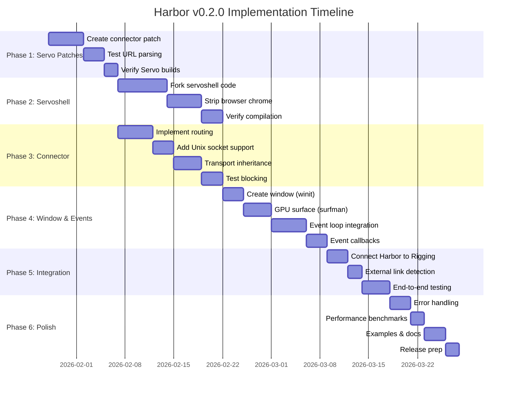
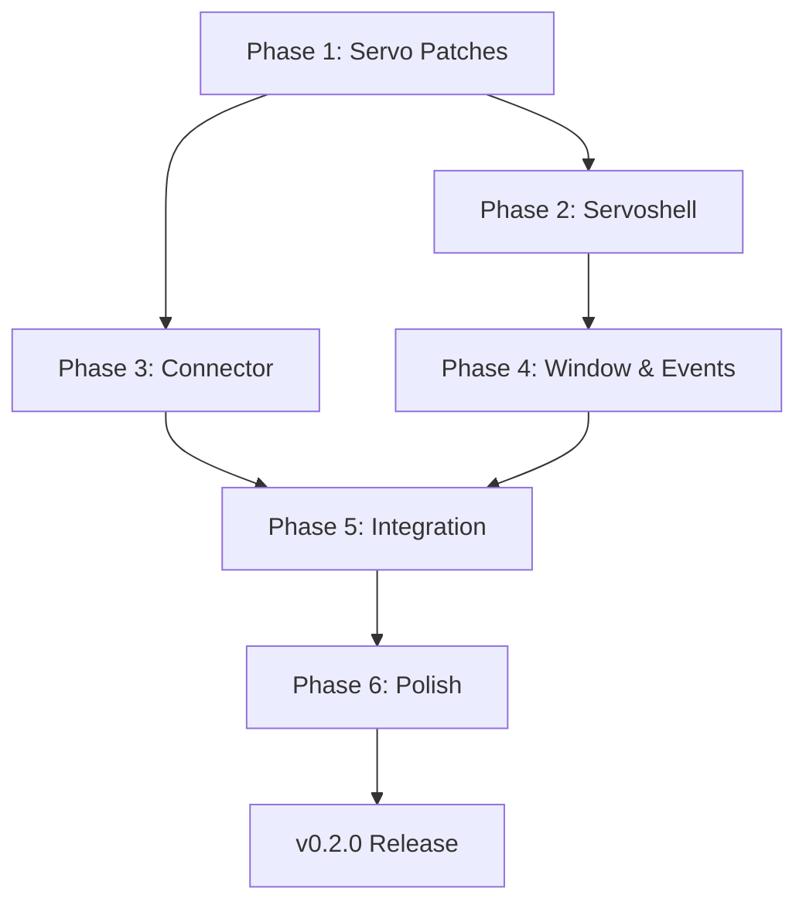

# Harbor v0.2.0 Roadmap

**Vision:** Security-first, Rust-based desktop application framework for local-first web apps

**Goal:** Replace subprocess Servo with embedded engine, enforce Unix-only networking, deliver native app experience

**Timeline:** 8-10 weeks (January - March 2026)

---

## 📊 Visual Timeline (Gantt Chart)



---

## 🎯 Milestones

### [Phase 1: Servo Patches & Setup](https://github.com/marctjones/harbor/milestone/1)
**Duration:** 1-2 weeks (Jan 28 - Feb 11)
**Goal:** Create and test Servo patches for connector injection

**Issues (3):**
- [#48](https://github.com/marctjones/harbor/issues/48) Create connector injection patch for Servo
- [#40](https://github.com/marctjones/harbor/issues/40) Implement native parsing for http::unix:// URL format
- [#39](https://github.com/marctjones/harbor/issues/39) Extend ServoUrl structure with TransportInfo enum

**Success Criteria:**
- ✅ Patches apply cleanly to upstream Servo
- ✅ Servo compiles with patches
- ✅ ServoBuilder::with_connector() method exists

---

### [Phase 2: Servoshell Integration](https://github.com/marctjones/harbor/milestone/2)
**Duration:** 2-3 weeks (Feb 4 - Feb 25)
**Dependencies:** Phase 1
**Goal:** Fork servoshell embedding code into Rigging, strip browser chrome

**Issues (2):**
- [#45](https://github.com/marctjones/harbor/issues/45) **EPIC:** Servo Embedding - Replace subprocess with embedded engine
- [#2](https://github.com/marctjones/harbor/issues/2) Fork servoshell into Rigging

**Success Criteria:**
- ✅ Rigging compiles with `cargo build --features servo`
- ✅ No browser chrome (URL bar, tabs, bookmarks removed)
- ✅ Window opens and renders content

---

### [Phase 3: Connector Injection](https://github.com/marctjones/harbor/milestone/3)
**Duration:** 1-2 weeks (Feb 11 - Feb 25)
**Dependencies:** Phase 1 & 2
**Goal:** Integrate UnixConnector with Servo, enforce transport restrictions

**Issues (5):**
- [#38](https://github.com/marctjones/harbor/issues/38) **EPIC:** Native transport-aware URL support
- [#44](https://github.com/marctjones/harbor/issues/44) Add Unix socket connection support in connector
- [#43](https://github.com/marctjones/harbor/issues/43) Extend connector to route based on transport type
- [#42](https://github.com/marctjones/harbor/issues/42) Add transport info bridge in http_loader.rs
- [#41](https://github.com/marctjones/harbor/issues/41) Implement relative URL resolution with transport inheritance

**Success Criteria:**
- ✅ Unix socket connections work
- ✅ TCP/HTTPS URLs blocked when `unix_only()` set
- ✅ http::unix:///tmp/app.sock/ URLs load correctly

---

### [Phase 4: Window & Events](https://github.com/marctjones/harbor/milestone/4)
**Duration:** 1-2 weeks (Feb 18 - Mar 4)
**Dependencies:** Phase 2
**Goal:** Full window lifecycle and event handling

**Issues (4):**
- [#46](https://github.com/marctjones/harbor/issues/46) **EPIC:** Window Management & Event Loop Integration
- [#51](https://github.com/marctjones/harbor/issues/51) Integrate Servo event loop with winit
- [#50](https://github.com/marctjones/harbor/issues/50) Implement GPU surface management with surfman
- [#49](https://github.com/marctjones/harbor/issues/49) Implement window creation with winit

**Success Criteria:**
- ✅ Window opens with correct size/title
- ✅ Mouse/keyboard input works
- ✅ Resize updates Servo viewport
- ✅ Close button exits cleanly

---

### [Phase 5: Harbor Integration](https://github.com/marctjones/harbor/milestone/5)
**Duration:** 1 week (Feb 25 - Mar 4)
**Dependencies:** Phase 4
**Goal:** Connect Harbor CLI to Rigging, end-to-end testing

**Issues (3):**
- [#54](https://github.com/marctjones/harbor/issues/54) End-to-end integration testing
- [#53](https://github.com/marctjones/harbor/issues/53) Connect Harbor CLI to Rigging embedded Servo
- [#52](https://github.com/marctjones/harbor/issues/52) Implement external link detection and OS browser delegation

**Success Criteria:**
- ✅ `harbor --example hello-flask` works
- ✅ External links open in system browser
- ✅ TCP URLs blocked
- ✅ Backend crash recovery works

---

### [Phase 6: Polish & Production](https://github.com/marctjones/harbor/milestone/6)
**Duration:** 1 week (Mar 4 - Mar 11)
**Dependencies:** Phase 5
**Goal:** Production-ready release with docs and examples

**Issues (11):**
- [#47](https://github.com/marctjones/harbor/issues/47) **EPIC:** Production Polish, Examples & Documentation
- [#37](https://github.com/marctjones/harbor/issues/37) Document lessons learned and next steps
- [#36](https://github.com/marctjones/harbor/issues/36) Performance benchmarking and optimization
- [#11](https://github.com/marctjones/harbor/issues/11) Add Node.js example
- [#10](https://github.com/marctjones/harbor/issues/10) Add FastAPI example
- [#9](https://github.com/marctjones/harbor/issues/9) Configuration validation and path expansion
- [#8](https://github.com/marctjones/harbor/issues/8) Backend stdout/stderr capture and log forwarding
- [#6](https://github.com/marctjones/harbor/issues/6) Socket permission setting (0600)
- [#5](https://github.com/marctjones/harbor/issues/5) Signal handling (SIGINT, SIGTERM)
- [#4](https://github.com/marctjones/harbor/issues/4) PID file management for backend processes
- [#3](https://github.com/marctjones/harbor/issues/3) Detailed error messages and recovery suggestions

**Success Criteria:**
- ✅ Comprehensive error messages
- ✅ Performance benchmarks documented
- ✅ 3+ working examples (Flask, FastAPI, Node.js)
- ✅ Documentation complete
- ✅ v0.2.0 ready for release

---

## 🚀 Post-v0.2.0: Future Work

### [Future: TUI-to-GUI Rendering](https://github.com/marctjones/harbor/milestone/7) (23 issues)
**Status:** Experimental, not part of core Harbor vision
**Epic:** [#12](https://github.com/marctjones/harbor/issues/12) Harbor as Universal TUI-to-GUI Renderer

This explores rendering TUI applications (Textual, Rich, Cursive) as GUI apps. May be explored after v0.2.0 if there's community interest.

---

## 📈 Progress Tracking

**GitHub Projects Board:** https://github.com/users/marctjones/projects/19

### Critical Path
```
Phase 1 → Phase 2 → Phase 3 → Phase 4 → Phase 5 → Phase 6 → v0.2.0 Release
```

### Blockers
- Phase 2, 3, 4, 5, 6 blocked until Phase 1 complete
- Phase 4, 5, 6 blocked until Phase 2 complete
- Phase 5, 6 blocked until Phase 4 complete
- v0.2.0 blocked until Phase 6 complete

### Key Dependencies


---

## 🎯 Vision Alignment

| Vision Pillar | Implementation | Status |
|---------------|----------------|--------|
| **Security by Architecture** | UnixConnector blocks TCP (Phase 3) | Planned |
| **Developer Freedom** | Any backend framework (Flask/Node/etc) | Working |
| **Performance & Efficiency** | Embedded Servo, benchmarks (Phase 6) | Planned |
| **Open Web & Servo** | Full Servo integration (Phase 2) | Planned |
| **Local-First Philosophy** | External links → OS browser (Phase 5) | Planned |

---

## 📊 Issue Statistics

- **Total Issues:** 51 (excluding TUI experimental work)
- **Epics:** 5 (4 core + 1 experimental)
- **Critical Issues:** 4
- **High Priority:** 15
- **Medium Priority:** 22
- **Low Priority:** 10

### By Component
- `servo-integration`: 18 issues
- `backend`: 8 issues
- `config`: 2 issues
- `documentation`: 5 issues

### By Effort
- **Small:** 12 issues (1-2 days each)
- **Medium:** 21 issues (3-5 days each)
- **Large:** 8 issues (1-2 weeks each)

---

## 🏁 Release Criteria

### v0.2.0 Must Have
- [x] Flask example works end-to-end
- [ ] Embedded Servo (not subprocess)
- [ ] Unix sockets only (TCP blocked)
- [ ] External links open in browser
- [ ] Window management working
- [ ] Error messages helpful
- [ ] Performance benchmarked
- [ ] Documentation complete

### v0.2.0 Nice to Have
- [ ] FastAPI example
- [ ] Node.js example
- [ ] Windows support (Named Pipes)
- [ ] macOS testing

---

## 📝 Next Steps

1. **Immediate (This Week):** Start Phase 1
   - Apply Servo patches
   - Test compilation
   - Verify ServoBuilder API

2. **Week 2-3:** Phase 2 (Servoshell)
   - Fork servoshell code
   - Strip browser chrome
   - Get Rigging compiling

3. **Week 4-5:** Phases 3-4 (Connector & Window)
   - Connector injection
   - Window management
   - Event loop

4. **Week 6-7:** Phase 5 (Integration)
   - Connect everything
   - End-to-end testing
   - External link handling

5. **Week 8:** Phase 6 (Polish)
   - Examples
   - Documentation
   - Release prep

---

**Last Updated:** January 28, 2026
**Project Board:** https://github.com/users/marctjones/projects/19
**Milestones:** https://github.com/marctjones/harbor/milestones
